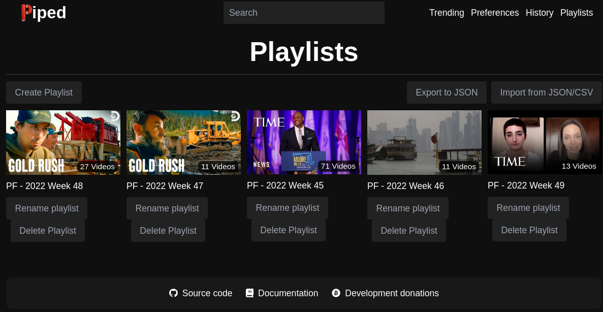

# piped-playfeed

Tool for [Piped](https://github.com/TeamPiped/Piped) and written in Go (Golang).

Keep your feeds clear by creating and keeping up-to-date weekly/monthly playlists, based on your subscriptions.




## Features

### Synchronization

The *Synchronization* feature offers an alternative to the *Feed* section by organizing the playlists in a structured way, still using the subscribed channels.

Basically, you decide:
* the creation strategy: one playlist by month or by week.
* the start date: most of the time you will pick the current date when using _piped-playfeed_ for the first time. All channels videos after this date will be handled by _piped-playfeed_.

Thanks to the playlists, you can remove videos you saw (or the ones that don't interest you) in order to only keep the videos to watch (that's the initial need that did motive me to develop this tool).

**Other benefit:** thanks to its mechanical, _piped-playfeed_ is not impacted by the common mismatch issue (see [#1130](https://github.com/TeamPiped/Piped/issues/1130)) between the channel videos and the content of the *Feed* section.

_Note:_ _piped-playfeed_ uses a local Sqlite database in order to avoid to perform too many requests when communicating with the Piped API.
Indeed, when _piped-playfeed_ discovers the new available videos, it memorizes the date of the last video encountered for each channel.<br>
Thus, at the next run, _piped-playfeed_ will stop to request channel videos once he will meet the last video seen during the previous run.<br>
==> it can be seen as a backup of your playlists feeds, but also as a kind of respect to the bandwidth of the hosted Piped instances shared by courtesy.

## How to install

### From releases

Releases contain prebuilt binaries for Linux, macOS and Windows. You can download them at [https://github.com/frajibe/piped-playfeed/releases](https://github.com/frajibe/piped-playfeed/releases).

### From sources

```bash
git clone https://github.com/frajibe/piped-playfeed.git
cd piped-playfeed
go build
```

## Usage

### Configure

First of all, create the following configuration file by copying [this template](https://github.com/frajibe/piped-playfeed/conf.json).

See below for the details of the configuration.

#### Base

| Attribute        | Description                             | Mandatory |       Default       |
|:-----------------|:----------------------------------------|:---------:|:-------------------:|
| `instance`       | An url to a Piped instance              |    YES    |                     |
| `account`        | Credentials for the Piped instance      |    YES    |                     |
| `database`       | Path to the local Sqlite database       |    no     | `piped-playfeed.db` |

#### Synchronization feature

| Attribute        | Description                                                                                | Mandatory |   Default   |
|:-----------------|:-------------------------------------------------------------------------------------------|:---------:|:-----------:|
| `playlistPrefix` | Prefix to apply on the managed playlist                                                    |    no     |     ``      |
| `strategy`       | Playlist creation strategy among `month` and `week`                                        |    no     |   `month`   |
| `type`           | Type among `duration` and `date`                                                           |    no     | `duration`  |
| `duration/unit`  | If `type`=`duration`. Duration unit among `year`, `month` and `date`                       |    no     |   `month`   |
| `duration/value` | If `type`=`duration`. Positive integer matching the duration unit                          |    no     |     `1`     |
| `date`           | If `type`=`date`. Format must be YYYY-MM-dd.<br/>Videos before this date won't be indexed. |    no     | 1 month ago |

### Usage

See the available arguments:
```bash
$ ./piped-playfeed --help

Usage of ./piped-playfeed:
  -conf string
        Provide the path to the configuration file (default "piped-playfeed-conf.json")
  -debug
        Enable debug logging
  -help
        Show help
  -log string
        Provide the path to the output log file (default "piped-playfeed-log.json")
  -silent
        Hide progress in console
  -sync
        Action: synchronize the playlists accordingly to the subscriptions
  -version
        Show version
```

### Examples

#### Example 1

Create **monthly** playlists based on the subscriptions since **one month** ago.

* Configuration

_piped-playfeed-conf.json_
```json
{
    "instance": "...",
    "account": {
        "username": "...",
        "password": "..."
    },
    "synchronization": {
        "strategy": "month",
        "type": "duration",
        "duration": {
            "unit": "month",
            "value": 1
        }
    }
}
```

* Commandline

```bash
$ ./piped-playfeed --sync
```

#### Example 2

Create **weekly** playlists based on the subscriptions since **2022-12-01**.<br>
The Sqlite database is located at `/opt/pf/piped-playfeed.db` and the configuration file is located at `/opt/pf/piped-playfeed-conf.json`.

* Configuration

_piped-playfeed-conf.json_
```json
{
    "instance": "...",
    "account": {
        "username": "...",
        "password": "..."
    },
    "database": "/opt/pf/piped-playfeed.db",
    "synchronization": {
        "strategy": "week",
        "type": "date",
        "date": "2022-12-01"
    }
}
```

* Commandline

```bash
$ ./piped-playfeed --conf /opt/pf/piped-playfeed-conf.json --sync
```

### Going further

In order to keep your playlists up-to-date with your feed, think about periodically running *piped-playfeed*.

It's up to you to decide this frequency depending on how often you visit Piped.

There are multiple solutions to periodically run an application, here are some examples:

* **Linux & Cron**

    Edit your own crontab file:
    ```bash
    $ crontable -e
  ```
    And then append this line to run the app every 3 hours. Feel free to adapt the periodicity, you can use this [generator](https://crontabkit.com/).

    ```
    0 */3 * * * bash -c '/home/me/piped-playfeed --conf /home/me/playfeed-conf.json --sync --silent'
    ```

    Every day at 4pm:

    ```
    0 16 * * * bash -c '/home/me/piped-playfeed --conf /home/me/playfeed-conf.json --sync --silent'
    ```

## Limitations known

### The first synchronization is so slow!

When synchronizing for the first time, the process may be long according to the selected start date.<br>
Indeed, it's actually a current limitation of the Piped API which only allows to insert one video at time into a playlist.

Thanks to the local database the next synchronizations will be faster.

## Troubleshooting

### A lock file prevents the app from running

A lock file is created at the startup of the application, and automatically removed once stopped. It actually prevents multiple instances from being running, for the sake of the synchronization process.

If this file is not removed, check the content of the log file in order to find out the reason, and finally remove the lock file.
If you think you're facing to a bug, please open a ticket on GitHub.

### It seems that the old videos are grouped by channel and then by date

YouTube provides a video timestamp more of less accurate, that's why it's not straightforward to sort the videos with a reliable publication date. Indeed, at some point the old videos have a rounded timestamp, and so when videos have the same timestamp, they are sorted by channel.

It happens when the synchronization is not ran often, the timestamp of the videos is too rounded. Try to synchronize more often in order to get the timestamps with the most accuracy possible.

## License

[MIT license](https://github.com/frajibe/piped-playfeed/LICENSE)
